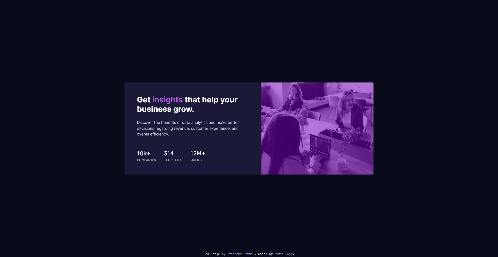

# Frontend Mentor - Stats preview card component solution

This is a solution to the [Stats preview card component challenge on Frontend Mentor](https://www.frontendmentor.io/challenges/stats-preview-card-component-8JqbgoU62). Frontend Mentor challenges help you improve your coding skills by building realistic projects.

## Table of contents

- [Overview](#overview)
  - [Screenshot](#screenshot)
  - [Links](#links)
- [My process](#my-process)
  - [Built with](#built-with)
  - [What I learned](#what-i-learned)
  - [Continued development](#continued-development)
- [Author](#author)

## Overview

### Screenshot



### Links

- [Solution URL](https://github.com/ahmedhanyh/stats-preview-card-component)
- [Live Site URL](https://ahmedhanyh.github.io/stats-preview-card-component/)

## My process

### Built with

- Semantic HTML5 markup
- CSS custom properties
- BEM class naming methodology
- Flexbox

### What I learned

I've learned a new css trick to set the semi-transparent color layer over the image from this [stack overflow thread](https://stackoverflow.com/questions/9182978/semi-transparent-color-layer-over-background-image) which utilizes the 'box-shadow' property like so:

```css
box-shadow: inset 0 0 0 1000px rgba(0, 0, 0, 0.2);
```

I didn't end up using it as I've made some changes to my code that required me to use a different way to achieve this.

### Continued development

I think I need to learn more about embedding images in HTML & CSS and making them responsive as I struggle everytime with images.

## Author

- GitHub - [@ahmedhanyh](https://github.com/ahmedhanyh)
- Frontend Mentor - [@ahmedhanyh](https://www.frontendmentor.io/profile/ahmedhanyh)
